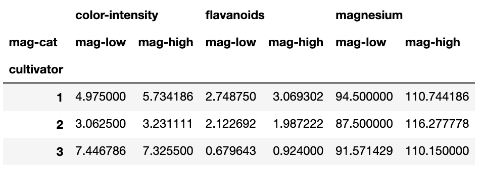

---
jupytext:
  cell_metadata_json: true
  encoding: '# -*- coding: utf-8 -*-'
  text_representation:
    extension: .md
    format_name: myst
kernelspec:
  display_name: Python 3 (ipykernel)
  language: python
  name: python3
language_info:
  name: python
  pygments_lexer: ipython3
  nbconvert_exporter: python
---

# regrouper par critères

```{code-cell} ipython3
import numpy as np
import pandas as pd
import matplotlib.pyplot as plt
```

```{code-cell} ipython3
import IPython
```

```{code-cell} ipython3
df = pd.read_csv('data/titanic.csv', index_col=0)
df.head(3)
```

+++ {"tags": ["framed_cell"]}

## dataframe, catégories et dimensions

````{admonition} →
en `pandas`, une table de données (encore appelée *dataframe*) a uniquement 2 dimensions

mais elle peut indiquer, avec ces deux seules dimensions, des sous-divisions dans les données

les passagers du Titanic sont ainsi divisés

* en homme/femme par la colonne `Sex`
* en passagers de première, seconde ou troisième classe par la colonne `Pclass`
* en survivants ou décédés par la colonne `Survived`
* on pourrait même les diviser en classe d'âge par la colonne `Age`  
   *enfants* (avant 12 ans), *jeunes* (entre 12 et 20), *adultes* (entre 20 et 60), *personne agées* (+ de 60 ans)

des analyses mettant en exergue ces groupes de personnes peuvent être intéressantes

lors du naufrage du Titanic, valait-il mieux être une femme en première classe ou un enfant en troisième ?

on va calculer des regroupements de lignes (des partitions de la dataframe)  
en utilisant la méthode `df.groupby()`  
à laquelle on indique un ou plusieurs critères.
````

+++

***

+++ {"tags": ["framed_cell"]}

## groupement par critère unique

````{admonition} →
le groupement (la partition) se fait par la méthode `df.groupby()`

prenons le seul critère de genre des passagers  
de la colonne `Sex`

la colonne a deux valeurs: `female` et `male`

```python
df['Sex'].unique()
-> array(['male', 'female'], dtype=object)
```

avec `groupby` `pandas` permet de partitionner la dataframe  
en autant de sous-dataframes que de valeurs uniques dans la colonne

faisons la partition de notre dataframe en

* la sous-dataframe des hommes i.e. `male`
* la sous-dataframe des femmes i.e. `female`
* nous pourrons alors procéder à des analyses différenciées par genre

partition par (`by`) l'unique colonne `Sex`  
```python
by_sex = df.groupby(by='Sex')
```

l'objet rendu par la méthode est de type `DataFrameGroupBy`
````

```{code-cell} ipython3
# le code
df['Sex'].unique()
```

```{code-cell} ipython3
# le code
by_sex = df.groupby(by='Sex')
by_sex
```

+++ {"tags": ["framed_cell"]}

### accès aux sous-dataframes

````{admonition} →
que faire avec un objet de type `DataFrameGroupBy` ?  
la méthode `gb.size()`  
donne la taille des deux partitions  
(sous la forme d'objet de type `pandas.Series`)

```python
by_sex.size()
-> Sex
female    314
male      577
dtype: int64
```

:::{admonition} on peut aussi itérer
:class: attention dropdown
moins fréquemment utile, mais:  
l'objet `pandas.DataFrameGroupBy` est aussi un objet **itérable**  
qui vous donne les couples `key, dataframe`

```python
for group, subdf in by_sex:
    print(group, subdf.shape) # subdf est de type pandas.DataFrame

-> female (314, 11)
   male (577, 11)
```

vous pouvez donc facilement parcourir toutes les sous-dataframes
:::
````

```{code-cell} ipython3
# les tailles des morceaux
by_sex.size()
```

```{code-cell} ipython3
# la somme est correcte
sum(by_sex.size()) == len(df)
```

```{code-cell} ipython3
# pour itérer 'à la main'
for group, subdf in by_sex:
    print(group, subdf.shape)
```

+++ {"tags": ["framed_cell"]}

### proxying : propagation de fonctions sur les sous-dataframes

````{admonition} →
itérer est intéressant d'un point de vue pédagogique  
pour bien comprendre la nature d'un objet `DataFrameGroupBy`  
et éventuellement inspecter son contenu de visu  

mais en pratique, on peut souvent utiliser une méthode des dataframes  
**directement** sur l'objet `DataFrameGroupBy` et il est rarement  
nécessaire d'itérer explicitement dessus  
(on n'aime pas avoir à écrire un for-Python)

dans ce cas l'objet `DataFrameGroupBy` se comporte comme un *proxy*:
- il propage le traitement à ses différents morceaux  
- et s'arrange pour combiner les résultats


par exemple on peut extraire une colonne sur toutes les sous-dataframe  
en utilisant la syntaxe `group[colonne]`, et faire des traitements sur le résultat

```python
# quel age ont le plus vieil homme et la plus vieille femme
by_sex['Age'].max()
```

ou encore on peut fabriquer une dataframe qui contient les sommes
de certaines colonnes de départ, mais par sexe

```python
# les sommes des colonnes 'Survived' et 'Fare', mais par sexe
by_sex[['Survived', 'Fare']].sum()
```
````

```{code-cell} ipython3
# souvent on traite un groupby comme une dataframe
# ce qui a l'effet d'appliquer l'opération (ici ['Age'])
# à toutes les sous-dataframe
by_sex['Age'].max()
```

```{code-cell} ipython3
by_sex[['Survived', 'Fare']].sum()
```

+++ {"tags": ["framed_cell"]}

### accéder à un groupe

````{admonition} →
on a parfois besoin d'accéder à un groupe précis dans la partition  
c'est possible avec la méthode `get_group()`  
qui retourne une dataframe

```python
by_sex.get_group('female')
```

comme pour les itérations, en général on n'a besoin de ça que pour farfouiller *à la main* dans les données...

````

```{code-cell} ipython3
# cette fois on obtient bien une dataframe

isinstance(by_sex.get_group('female'), pd.DataFrame)
```

```{code-cell} ipython3
by_sex.get_group('female').head(4)
```

+++ {"tags": ["framed_cell"]}

## groupement multi-critères

````{admonition} →
pour des partitions multi-critères  
passez à `df.groupby()` une **liste des colonnes**

la méthode `df.groupby()`

* calcule les valeurs distinctes de chaque colonne (comme dans le cas du critère unique)
* et ensuite il en fait le **produit cartésien**
* on obtient ainsi les clés des groupes sous la forme de tuples

prenons les critères `Pclass` et`Sex`

* le premier critère a trois valeurs `1`, `2` et `3` (pour les trois classes de cabines)
* le second a 2 valeurs `female` et `male`

on s'attend donc aux 6 clés  
`(1, 'female')`, `(1, 'male')`  
`(2, 'female')` `(2, 'male')`  
`(3, 'female')` `(3, 'male')`  
(ou du moins à un sous-ensemble de ces 6 clés)

on regroupe

```python
by_class_sex = df.groupby(['Pclass', 'Sex'])
```

utilisons `size()` pour voir les clés du groupement  
ici tous les cas du produit cartésien sont représentés

```python
by_class_sex.size()
->
Pclass  Sex
1       female     94
        male      122
2       female     76
        male      108
3       female    144
        male      347
dtype: int64
```

nous découvrons là une `pandas.Series` avec un `index` **composé de tuples**  
qu'en pandas on appelle **un *MultiIndex***
````

```{code-cell} ipython3
# le code
by_class_sex = df.groupby(['Pclass', 'Sex'])
by_class_sex.size()
```

+++ {"tags": ["framed_cell"]}

### multi-index pour les multi-critères

````{admonition} →
inspectons de plus près l'index qui est en jeu ici  
partons du résultat de `by_class_sex.size()` qui est une `pandas.Series`

```python
type(by_class_sex.size())
-> pandas.Series
```

son `index` est un `MultiIndex`

```python
df_by_class_sex.size().index
->
MultiIndex([(1, 'female'),
            (1,   'male'),
            (2, 'female'),
            (2,   'male'),
            (3, 'female'),
            (3,   'male')],
           names=['Pclass', 'Sex'])

```

les index sont **les tuples** du produit cartésien  
on aurait pu aussi les calculer par une compréhension Python comme ceci
```python
{(i, j) for i in df['Pclass'].unique() for j in df['Sex'].unique()}
->
{(3, 'male'),
 (3, 'female'),
 (1, 'male'),
 (1, 'female'),
 (2, 'male'),
 (2, 'female')}
```
````

```{code-cell} ipython3
# le code
type(by_class_sex.size())
```

```{code-cell} ipython3
df.groupby(['Pclass', 'Sex']).size().index
```

```{code-cell} ipython3
# le code
computed_index = {(i, j) for i in df['Pclass'].unique() for j in df['Sex'].unique()}
computed_index
```

```{code-cell} ipython3
# pour vérifier
computed_index == set(df.groupby(['Pclass', 'Sex']).size().index)
```

+++ {"tags": ["framed_cell"]}

### les éléments de l'index sont des tuples

````{admonition} →
les éléments dans le `MultiIndex` sont donc des tuples Python

par exemple, nous pouvons toujours itérer sur les sous-dataframes  
de la partition, sauf qu'ici ce qui décrit le groupe, c'est un 2-tuple  
donc on adapterait l'itération sur ce groupby multi-critère  
comme ceci

```python
for (class_, sex), subdf in by_class_sex:
    print(f"there were {len(subdf)} {sex} in class {class_} ")

there were 94 female in class 1
there were 122 male in class 1
there were 76 female in class 2
there were 108 male in class 2
there were 144 female in class 3
there were 347 male in class 3
```

````

```{code-cell} ipython3
# le code
for (class_, sex), subdf in by_class_sex:
    print(f"there were {len(subdf)} {sex} in class {class_} ")
```

voyez l'exercice sur les partitions `groupby` [déplacé en fin de notebook](#label-exo-groupby)

+++

## catégorie à partir d'une colonne numérique

+++ {"tags": ["framed_cell"]}

````{admonition} →
parfois il y a trop de valeurs différentes dans une colonne  
du coup on veut faire un découpage de ces valeurs en intervalles

par exemple dans la colonne des `Age`  

* si nous faisons un groupement brutal sur cette colonne  
comme nous avons 88 âges différents  
cela ne donne pas d'information intéressante

* mais ce serait intéressant de raisonner par **classes** d'âges par exemple
   - *'enfant'* jusqu'à 12 ans
   - *'jeune'* entre 12 ans (exclus) et 19 ans (inclus)
   - *'adulte'* entre 19 (exclus) et 55 ans (inclus)
   - *'+55'*  les personnes de strictement plus de 55 ans  

afin de classifier ainsi la colonne des ages, `pandas` propose la fonction `pandas.cut`

nous allons voir un exemple

```python
pd.cut?
```
````

```{code-cell} ipython3
# le code (à décommenter pour essayer)
# pd.cut?
```

+++ {"tags": ["framed_cell"]}

###  découpage en intervalles d'une colonne

````{admonition} →
avec `pandas.cut` nous allons créer dans notre dataframe  
une nouvelle colonne qui contient les intervalles d'ages  
`(0, 12]`, `(12, 19]`, `(19, 55]` et  `(55, 100]`

`pandas.cut`

* prend en paramètre une `Series`
* vous devez précisez les bornes de vos intervalles avec le paramètre `bins`  
* les bornes min des intervalles seront exclues  
  (autrement dit vous pouvez mentalement interpréter `(0, 12]` comme `]0, 12]` si vous préférez)
* la fonction retourne une nouvelle `Series`, avec le même index et de type `category`

```python
pd.cut(df['Age'], bins=[0, 12, 19, 55, 100])
->
PassengerId
552    (19.0, 55.0]
638    (19.0, 55.0]
499    (19.0, 55.0]
261             NaN   <- age inconnu au départ
395    (19.0, 55.0]
           ...
326    (19.0, 55.0]
396    (19.0, 55.0]
832     (0.0, 12.0]
Name: Age, Length: 891, dtype: category
Categories (4, interval[int64, right]): [(0, 12] < (12, 19] < (19, 55] < (55, 100]]
```

remarquez  

* on doit donner toutes les bornes des intervalles  
  (les bornes se comportent comme des poteaux: ici 5 bornes produisent 4 intervalles)  

* les bornes min des intervalles sont bien exclues
* la colonne est de type `category`,  et cette catégorie est ordonnée
* des labels sont générés par défaut
* les items en dehors des bornes sont transformés en `nan`

vous pouvez donner des labels aux intervalles avec le paramètre `labels`

```python
pd.cut(df['Age'],
       bins=[0, 12, 19, 55, 100],
       labels=['child', ' young', 'adult', '55+'])
```

souvent on va ranger cette information dans une nouvelle colonne  
et ça on sait déjà comment le faire
```python
df['Age-class'] = pd.cut(
    df['Age'],
    bins=[0, 12, 19, 55, 100],
    labels=['child', ' young', 'adult', '55+'])
```

comment feriez-vous pour inspecter le type (des valeurs) de cette colonne ?  
est-ce un type ordonné ?

**révision**  
comment feriez-vous pour vous débarrasser maintenant de la colonne `Age` dans la dataframe

````

```{code-cell} ipython3
# le code
pd.cut(df['Age'], bins=[0, 12, 19, 55, 100])
```

```{code-cell} ipython3
# le code
# pareil mais avec des labels ad-hoc
age_class_series = pd.cut(df['Age'], bins=[0, 12, 19, 55, 100],
       labels=['child', 'young', 'adult', '55+'])
age_class_series
```

```{code-cell} ipython3
# pour ranger ça dans une nouvelle colonne
df['Age-class'] = age_class_series
```

```{code-cell} ipython3
# le type est une catégorie, il est bien ordonné
age_class_series.dtype
```

```{code-cell} ipython3
# pour effacer la colonne 'Age'
print("avant", df.columns)
del df['Age']
print("après", df.columns)
# on peut utiliser aussi df.drop
# df.drop('Age', axis=1, inplace=True)
```

###  groupement avec ces intervalles

````{admonition} →
nous avons la colonne `Age-classes`

comme c'est un type catégorie, vous pouvez utiliser cette colonne dans un `groupby`

```python
df.groupby(['Age-class', 'Survived', ])
```

vous avez désormais une idée de l'utilisation de `groupby`  
pour des recherches multi-critères sur une table de données

::::{admonition} exercice
calculez les taux de survie de chaque classe d'age par classes de cabines

:::{admonition} solution
:class: dropdown tip
```{code-cell} python
df.groupby(['Age-class', 'Survived']).size()
```
:::
::::
````

+++ {"tags": ["framed_cell"]}

## `pivot_table()`

````{admonition} →
le type d'opérations que l'on a fait dans ce notebook est fréquent  
spécifiquement, on veut souvent afficher:

* une valeur (précisément, une aggrégation des valeurs) d'une colonne  
* en fonction de deux autres colonnes (catégorielles)    
* qui sont utilisées dans les directions horizontale et verticale  
  (typiquement, une colonne sera en index et l'autre en columns)

par exemple, on voudrait visualiser:

* le taux de survie (la valeur à agréger)  
* par classe de cabine (l'index des lignes)
* et par genre (les colonnes)
* comme ceci:  
  ```{image} media/pivot-titanic.png
  :width: 200px
  ```

il existe une méthode `pivot_table()` qui s'avère très pratique  
pour faire précisément ce genre de traitement **en un seul appel**  
comme toujours, pensez à lire la doc avec `df.pivot_table?`

les paramètres les plus importants sont

* `values` : la (ou les) colonne(s) qu'on veut regarder  
  ce seront les valeurs **dans le tableau**

* `index` : la (ou les) colonne(s) utilisée(s) pour **les lignes** du résultat
* `columns` : idem pour **les colonnes**
* `aggfunc` : la fonction d'aggrégation à utiliser sur les `values`  
  il y a toujours plusieurs valeurs qui tombent dans une case du résultat  
  il faut les agréger; par défaut on fait **la moyenne**  
  (ce qui convient bien avec 'Survived')

ainsi la table ci-dessus s'obtient **tout simplement** comme ceci

```python
df.pivot_table(
    values='Survived',
    index='Pclass',
    columns='Sex',
)
```
````

```{code-cell} ipython3
# df.pivot_table?
```

```{code-cell} ipython3
# pour obtenir la table ci-dessus

df.pivot_table(
    values='Survived',
    index='Pclass',
    columns='Sex',
)
```

+++ {"tags": ["framed_cell"]}

### `pivot_table()` et agrégation

`````{admonition} →
dans le cas présent on n'a **pas précisé** la fonction d'**aggrégation**  
du coup c'est **la moyenne** qui est utilisée comme agrégation,  
sur la valeur de `Survived` (car `values='Survived'`)   
qui vaut 0 ou 1 selon les cas, et donc on obtient le taux de survie  

````{admonition} → les aggrégations prédéfinies
:class: admonition-small dropdown

Quand on utilise le paramètre `aggfunc` de `pivot_table()`, on doit en principe lui passer une - ou plusieurs - fonctions;  
cela dit par commodité `pandas` permet aussi de passer une chaine de caractères, pour les agrégations les plus courantes;

voici la liste des raccourcis connus - ils correspondent à la méthode du même nom dans la classe `Series`

```{list-table}
:header-rows: 1

* - Function
  -	Description
* - count
  -	Number of non-null observations
* - size
  -	Number of rows (including NaN)
* - nunique
  -	Number of unique values
* - first
  -	First valid observation
* - last
  -	Last valid observation
* - sum
  -	Sum of values
* - prod
  -	Product of values
* - mean
  -	Mean of values
* - median
  -	Median of values
* - min
  -	Minimum value
* - max
  -	Maximum value
* - std
  -	Standard deviation
* - var
  -	Variance
* - sem
  -	Standard error of mean
* - skew
  -	Sample skewness
* - kurt
  -	Sample kurtosis
```
````

````{admonition} Exercice
:class: tip

1. obtenez la même table que ci-dessus avec cette fois le nombre de survivants
1. pareil en affichant pour chaque groupe: 
   - le nombre de personnes concernées
   - le nombre de survivants 
   - **et** le taux de survie
1. (optionnel) que pensez-vous de la présentation du résultat ?  
   ce pourrait être l'occasion de regarder 
   [du coté de `Index.reorder_levels()`](https://pandas.pydata.org/docs/reference/api/pandas.MultiIndex.reorder_levels.html)
````

`````

```{code-cell} ipython3
:tags: [level_basic]

# votre code
```

+++ {"tags": ["framed_cell"]}

### `pivot_table()` et multiples critères

````{admonition} →
en fait, il est même possible de passer aux 3 paramètres  
`values`, `index` et `columns` des **listes** de colonnes

le résultat dans ce cas utilise un `MultiIndex`  
pour en quelque sorte "ajouter une dimension"  
dans l'axe des x ou des y, selon les cas

**exercice**  
observez les résultats obtenus par exemple  
en ajoutant dans chacune des dimensions

* comme valeur supplémentaire `Age`
* comme critère supplémentaire `Embarked`  

et notamment que pouvez-vous dire des index (en lignes et en colonnes)  
du résultat produit par `pivot_table()`
````

```{code-cell} ipython3
# relisons depuis le fichier pour être sûr d'avoir la colonne 'Age'
df = pd.read_csv('data/titanic.csv')
```

```{code-cell} ipython3
:tags: [level_basic]

# votre code
# plusieurs values
# df2 = ...
# pensez à observer les index du résultat
# df2.columns
# df2.index
```

```{code-cell} ipython3
:tags: [level_basic]

# votre code
# plusieurs columns
# df3 = ...
# pensez à observer les index du résultat
# df3.columns
# df3.index
```

```{code-cell} ipython3
:tags: [level_basic]

# votre code
# plusieurs index
# df4 = ...
# pensez à observer les index du résultat
# df4.columns
# df4.index
```

## `groupby.filter()` - optionnel

````{admonition} →
pour enlever de la dataframe des lignes correspondants à des groupes qui vérifient une certaine propriété

on récupère comme résultat **une dataframe** (et non pas un groupby comme on aurait pu le penser)

pour illustrer ça, on ne va conserver que les groupes dont la taille est inférieure à 100  
c'est très artificiel comme exemple, mais peu importe; on écrirait

```python
extract = gb.filter(lambda df: len(df) <= 100)
```

la fonction en paramètre doit s'appliquer à une dataframe

à ce stade on a une dataframe qui ne contient que les personnes appartenant aux petits groupes

````

```{code-cell} ipython3
# le code

df = pd.read_csv("data/titanic.csv")

gb = df.groupby(by=['Sex', 'Pclass'])

# pour construire une dataframe ne contenant que les groupes 
# qui satisfont une certaine condition
extract = gb.filter(lambda df: len(df) <= 100)
```

```{code-cell} ipython3
# pour vérifier: 
# regardons les tailles des groupes

print(f"titanic has {len(df)} items")
for group, subdf in gb:
    print(f"group {group} has {len(subdf)} matches")
```

on doit donc ne retenir que 94+76 = 170 personnes

```{code-cell} ipython3
len(extract) == (94 + 76)
```

***

## `groupby.transform()` - optionnel

+++ {"tags": ["framed_cell", "level_intermediate"]}

````{admonition} →
pour appliquer aux différents groupes une fonction **qui prend en compte les éléments du groupe**  

exemples d'application typiques:
- centrer chacun des groupes autour de la moyenne (du groupe)
- remplacer les NaN par la moyenne du groupe

```python
df['Age'] = gb['Age'].transform(lambda series: series-series.mean())
```

remarquez que la fonction travaille cette fois en fait sur une série

on peut utiliser cette approche pour, par exemple, remplir les âges manquants avec la moyenne du groupe

````

```{code-cell} ipython3
# centrons la colonne des ages **groupe par groupe**
# avec nos 6 groupes habituels

# à nouveau c'est un peu artificiel comme exemple, never mind

df = pd.read_csv("data/titanic.csv")
gb = df.groupby(by=['Sex', 'Pclass'])

# on retire à chaque Age la moyenne d'age **du groupe**

df['Age'] = gb['Age'].transform(lambda series: series-series.mean())
df.head(3)
```

```{code-cell} ipython3
# utilisons la même approche pour remplir les ages manquants
# par la moyenne de chaque groupe

df = pd.read_csv("data/titanic.csv")
gb = df.groupby(by=['Sex', 'Pclass'])

# pour pouvoir vérifier qu'on a bien fait le job

print(f"===== avant: on a {sum(df['Age'].isna())} âges indéterminés")
print(f"et les moyennes d'âges par groupe sont de")
IPython.display.display(df.pivot_table(values="Age", index="Sex", columns="Pclass"))

# on remplit
df['Age'] = df['Age'].fillna(gb['Age'].transform('mean'))

# on n'a plus de NaN et les moyennes sont inchangées
print()
print(f"===== après: on a {sum(df['Age'].isna())} ages indéterminés")
print(f"et les moyennes d'âges par groupe sont de")
IPython.display.display(df.pivot_table(values="Age", index="Sex", columns="Pclass"))
```

## pour résumer

- pour faire des groupements multi-critères on utilise `df.groupby()`
  - qui renvoie un objet de type `GroupBy` ou similaire
- qu'on utilise généralement **comme un proxy**
  - qui va propager les traitements sur les différents "morceaux"
  - que l'on peut agréger ensuite "normalement"
- lorsqu'on utilise plusieurs critères les index deviennent des `MultiIndex`
  - c'est-à-dire dont les valeurs sont des tuples
- avec `pivot_table()` on peut facilement obtenir des tables de synthèse
  - en fait, `pivot_table()` utilise `groupby` sans le dire
  - (et remet les résultats en forme grâce à `unstack()`, mais c'est pour les avancés...)

+++ {"tags": ["level_intermediate"]}

## pour en savoir plus

- pour creuser cette notion de `stack()/unstack()`, et comment `pivot_table()` s'en sert, voyez

  - ce document <https://numerique-exos.info-mines.paris/pandas-howtos/pivot-unstack-groupby/howto-pivot-unstack-groupby-nb/>
  - ou encore celui-ci <https://numerique-exos.info-mines.paris/pandas-tps/merge-group/readme-merge-group-nb/>

- on recommande la lecture de cet article dans la documentation `pandas`, qui approfondit le sujet et notamment la notion de `split-apply-combine`  
  (qui rappelle, de loin, la notion de *map-reduce*)  
  <https://pandas.pydata.org/pandas-docs/stable/user_guide/groupby.html>

+++

(label-exo-groupby)=
## **exercice** sur `groupby()`

on veut calculer la partition de la dataframe du titanic avec comme critères:  
 la classe `Pclass`, le genre `Sex`, et l'état de survie `Survived`

1. sans calculer la partition  
   proposez une manière de calculer le nombre probable de sous parties dans la partition

```{code-cell} ipython3
:tags: [level_basic]

# votre code
```

2. calculez la partition avec `df.groupby`  
   et affichez les nombres d'items par groupe

```{code-cell} ipython3
:tags: [level_basic]

# votre code
```

3. affichez la dataframe des entrées pour les femmes qui ont péri et qui voyagaient en 1ère classe

```{code-cell} ipython3
:tags: [level_basic]

# votre code
```

4. **révision**: refaites la même extraction sans utiliser un `groupby()` en utilisant un masque

```{code-cell} ipython3
:tags: [level_basic]

# votre code
```

5. **pour les élèves avancés**  
   créez un `dict` avec les taux de survie par genre dans chaque classe

   vous devez obtenir quelque chose de ce genre
   ```
   {('female', 1): 0.96,
    ('female', 2): 0.92,
    ('female', 3): 0.5,
    ('male', 1): 0.36,
    ('male', 2): 0.15,
    ('male', 3): 0.13}
   ```

   ```{admonition} indice
   :class: dropdown tip
   Voyez la méthode `to_dict()` sur les `Series`
   ```

```{code-cell} ipython3
:tags: [level_basic]

# votre code
```

6.  **pour les élèves avancés**  
   créez à partir de ce `dict` une `pandas.Series`  
   avec comme nom `'taux de survie par genre dans chaque classe'`  
   **indice:** comme tous les types en Python  
   `pd.Series()` permet de créer des objets par programme  
   voyez la documentation de `pd.Series`

```{code-cell} ipython3
:tags: [level_basic]

# votre code
```

(label-exo-pivot)=
## **exercice** sur `pivot_table()`

```{code-cell} ipython3
df = pd.read_csv('data/wine.csv')
df.head(2)
```

1. affichez les valeurs min, max, et moyenne, de la colonne 'magnesium'

```{code-cell} ipython3
:tags: [level_basic]

# votre code
```

2. définissez deux catégories selon que le magnesium est en dessous ou au-dessus de la moyenne (qu'on appelle `mag-low` et `mag-high`); rangez le résultat dans une colonne `mag-cat`

```{code-cell} ipython3
:tags: [level_basic]

# votre code
```

3. calculez cette table



```{code-cell} ipython3
:tags: [level_basic]

# votre code
```
